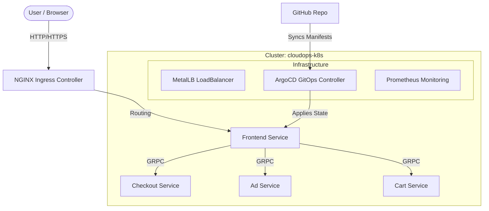

# End-to-End Microservices GitOps Pipeline


<!--  -->
<!--  -->

This project demonstrates a production-grade **Kubernetes** environment running locally using **Kind**, managed via **GitOps (ArgoCD)**, and monitored with **Prometheus/Grafana**. It serves as a showcase of CloudOps skills including traffic management, auto-scaling, and self-healing infrastructure.

## 🏗 Architecture

The cluster simulates a cloud environment with the following components:



## 🚀 Key Features

*   **GitOps Workflow**: Application state is defined in Git and automatically synced by ArgoCD.
*   **Infrastructure as Code**: Local environment provisioning via Terraform-like manifest management.
*   **Traffic Management**: NGINX Ingress Controller handling routing and TLS termination.
*   **High Availability**: Stateless apps managed by Replocasets; Self-healing via Liveness/Readiness probes.
*   **Observability**: *[Planned]* Full metrics pipeline with Prometheus and Grafana dashboards.

## 🛠 Prerequisites

*   **Docker Desktop** (Allocated 6GB+ RAM)
*   **Kubernetes CLI (`kubectl`)**
*   **Helm**
*   **Kind** (Kubernetes in Docker)
*   **PowerShell** (for setup scripts)

## ⚡ Quick Start

### 1. Initialize the Cluster
We use a custom script to create a multi-node Kind cluster and set up a local Docker registry.

**PowerShell**
```powershell
cd clusters
.\setup-cluster.ps1
```

**Command Prompt (cmd)**
```cmd
cd clusters
kind create cluster --config kind-config.yaml --name cloudops-k8s
```
*Note: The cmd option does not automatically setup the local registry, which is fine for basic testing.*

### 2. Install Core Infrastructure
Deploy the Ingress Controller and MetalLB (Load Balancer).

```bash
# Install NGINX Ingress
kubectl apply -f infra/ingress-nginx.yaml

# Install MetalLB
kubectl apply -f infra/metallb-native.yaml
kubectl apply -f infra/metallb-config.yaml
```

### 3. Setup GitOps (ArgoCD)
Install ArgoCD and configure the root application.

```bash
# Install ArgoCD
kubectl create namespace argocd
kubectl apply -n argocd -f argocd/install.yaml
kubectl apply -n argocd -f argocd/ingress.yaml

# Apply the GitOps Application
kubectl apply -f argocd/application.yaml
```

### 4. Verify & Access
Wait for ArgoCD to sync the application. You can check the status via the UI or CLI.

**Access ArgoCD UI:**
1.  **URL:** `https://argocd.localhost:8443` (Accept self-signed cert warning)
2.  **Username:** `admin`
3.  **Password:** Run this command to get the initial password:
    ```bash
    kubectl -n argocd get secret argocd-initial-admin-secret -o jsonpath="{.data.password}" | base64 -d; echo
    ```

**Access Web Frontend:**
*   **URL**: `http://localhost:80` (Proxied via NGINX Ingress)

**Grafana:**
*   *[Coming Soon]* `http://localhost:3000`


### Zero-Downtime Deployment
I implemented **RollingUpdates** with readiness probes. When a new version is pushed to Git, ArgoCD gradually replaces pods. The `readinessProbe` ensures traffic is not sent to a pod until it's fully initialized, guaranteeing zero 500 errors during updates.

### Self-Healing & GitOps
If a pod crashes, Kubernetes restarts it (Liveness Probe). If someone manually deletes a deployment resource via `kubectl`, ArgoCD detects the "Out of Sync" state and automatically re-applies the manifest from Git, ensuring the cluster always matches the source of truth.

### Scalability
The `HorizontalPodAutoscaler` monitors CPU usage (scraped by Prometheus). If the Frontend service exceeds 50% CPU utilization, the HPA automatically provisions new replicas to handle the load.

## 📁 Repository Structure

```
├── apps/               # Application manifests (Microservices Demo)
├── argocd/             # GitOps configuration (App of Apps)
├── clusters/           # Cluster provisioning (Kind config, Scripts)
└── infra/              # Core infrastructure (Ingress, MetalLB, Monitoring)
```
